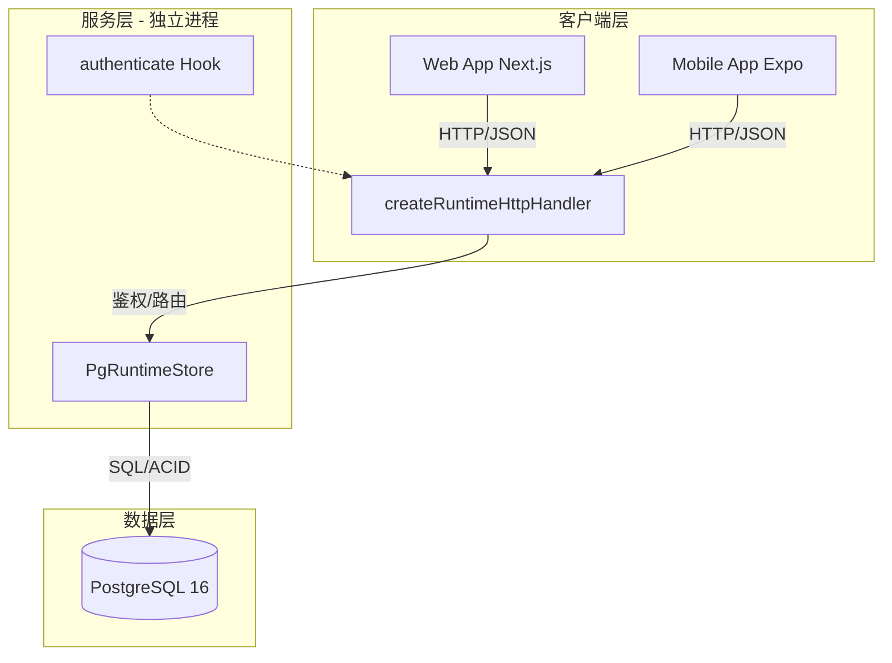

### OpenMAIC 移动端接入与存储层重构项目执行方案书

> **文档版本**：v1.0
> **适用范围**：OpenMAIC Expo 端接入、存储后端重构、Web 端数据迁移
> **核心目标**：实现 Web/Mobile 多端统一、存储层服务端化、架构彻底解耦

---

### 第一部分：项目背景与战略对齐

#### 1. 现状痛点分析
-   **数据孤岛效应**：当前 OpenMAIC 核心引擎强依赖浏览器 IndexedDB (`BrowserRuntimeStore`)，用户学习进度锁定在单一设备，无法跨端流转。
-   **移动端能力缺失**：React Native (Expo) 环境无原生 IndexedDB 全局对象，现有引擎无法直接复用，阻碍产品矩阵扩展。
-   **架构耦合风险**：传输层与存储后端未分离，缺乏独立部署能力，难以支撑未来多租户、离线同步及高并发场景。

#### 2. 核心战略目标
-   **多端统一体验**：将 OpenMAIC 核心教学/交互能力无缝扩展至 Expo 移动端，实现 Web 与 Mobile 数据实时同步。
-   **存储层服务化**：从“浏览器本地存储”升级为“服务端集中式存储”，建立以 Postgres 为基石的持久化体系。
-   **架构生产级解耦**：严格分离 HTTP 传输层与 RuntimeStore 存储层，为后续扩展预留标准化接口。

#### 3. 业务约束确认清单
| 约束维度 | 决策选项 | 当前建议状态 | 备注 |
| :--- | :--- | :--- | :--- |
| Web 存量数据 | A.可丢弃 / B.必须同步 / C.暂时隔离 | **B. 必须同步** | 保障用户体验连续性 |
| 离线能力需求 | A.纯在线 / B.弱网可用 / C.全离线 | **A. 纯在线优先** | MVP 阶段降低复杂度 |
| 运维承受能力 | A.Serverless / B.独立容器 / C.托管DB | **B. 独立容器** | 避免连接池冷启动问题 |

---

### 第二部分：架构设计与选型决策

#### 4. 候选方案对比论证
| 评估维度 | 方案 A：Next.js API Route 代理 | 方案 B：独立 Storage Server + PG (✅推荐) |
| :--- | :--- | :--- |
| **技术可行性** | ❌ Node.js 无 indexedDB 全局对象，BrowserRuntimeStore 必然崩溃 | ✅ 官方原生支持 createReferenceRuntimeServer |
| **数据一致性** | ❌ 无法解决多端并发写入冲突，seq 分配不可靠 | ✅ Postgres ACID 事务保障 seq 严格递增 |
| **部署独立性** | ❌ 耦合 Next.js 进程，受 Serverless 冷启动影响 | ✅ 独立进程，连接池/扩缩容完全可控 |
| **协议合规性** | ⚠️ 需手动适配 runtime-http-contract | ✅ 内置 createRuntimeHttpHandler 标准实现 |

#### 5. 最终架构拓扑


#### 6. 核心协议契约规范
-   **Session 创建**：客户端提交 `stageId` + `runtimeDslVersion`，服务端返回 `sessionId`；禁止客户端生成 ID。
-   **Record 追加**：客户端提交 `Omit<RuntimeRecord, 'seq'>`，**服务端独占分配递增 seq**，客户端伪造 seq 将被拒绝。
-   **鉴权机制**：通过 `Authorization` Header 传递 Token，服务端 `authenticate` 钩子解析 `learnerKey`，未认证请求返回 401。
-   **错误码规范**：严格遵循 `SESSION_NOT_FOUND`、`FUTURE_VERSION`、`INVALID_SEQ` 等标准错误码语义。

---

### 第三部分：类型系统与契约前置

#### 7. 纯接口类型提取策略
-   **零运行时依赖**：从 `@openmaic/storage` 源码剥离所有 class/function，仅保留 interface/type 定义。
-   **JSDoc 完整标注**：每个字段附带语义说明、取值范围、服务端校验规则，作为跨端协作的唯一真相源。
-   **防误用设计**：`RuntimeRecordInit` 显式排除 `seq` 字段，编译期阻止客户端伪造排序值。

#### 8. 核心类型清单（28 个）
| 类别 | 关键类型 | 用途 |
| :--- | :--- | :--- |
| Session | RuntimeSession, SessionCreateParams | 会话生命周期管理 |
| Record | RuntimeRecord, RuntimeRecordInit, RecordAppendParams | 交互记录读写 |
| Query | ListRecordsOptions, RecordFilter | 分页/过滤查询 |
| Error | StorageErrorCode, StorageApiError | 标准化错误处理 |
| Auth | LearnerIdentity, AuthContext | 鉴权上下文传递 |

---

### 第四部分：分阶段实施路线图

#### Phase 0: 环境准备与基线验证（0.5 天）
-   [ ] Clone 仓库并安装依赖，本地启动 Next.js 开发服务器
-   [ ] 验证 Web 端 IndexedDB 模式正常工作，产生测试数据
-   [ ] Monorepo 中初始化 `apps/expo`，配置 TS/ESLint/基础 UI 库
-   [ ] **验收点**：Web 端可交互 + Expo 空项目可启动模拟器

#### Phase 1: 类型契约与兼容性预研（0.5 天）
-   [ ] 输出 `types/maic-storage.ts` 纯接口文件
-   [ ] 测试 `@openmaic/storage/runtime/http` 在 RN 环境的 import 兼容性
-   [ ] 若兼容失败，启动纯 Fetch 手写封装预案评估
-   [ ] **验收点**：类型文件零报错 + RN 兼容性结论明确

#### Phase 2: 独立 Storage Server 搭建（1 天）
-   [ ] Docker Compose 部署本地 Postgres 16
-   [ ] 新建 `packages/maic-storage-server`，集成 `createReferenceRuntimeServer`
-   [ ] 实现 `authenticate` / `authorizeMerge` / `authorizeAdmin` 钩子
-   [ ] cURL 冒烟测试 `POST /sessions` + `POST /sessions/:id/records`
-   [ ] **验收点**：接口返回正确 JSON + PG 表中有数据落盘

#### Phase 3: Expo 端网络层对接（1 天）
-   [ ] 基于兼容性结论选择 HttpRuntimeStore 或自研 ExpoRuntimeStore
-   [ ] 处理 RN localhost/IP 映射陷阱，统一拦截器注入 Token
-   [ ] 接入 Zustand/React Query，实现 Session 列表拉取 + Record 追加
-   [ ] **验收点**：Expo 按钮点击 → PG 出现正确记录 + seq 服务端分配

#### Phase 4: Web 端迁移与多端同步（1.5 天）
-   [ ] 编写 IndexedDB → HttpRuntimeStore 一次性迁移脚本
-   [ ] 采用“只增不删”策略，确认服务端落盘前保留本地数据
-   [ ] Web 端全面切换至 HttpRuntimeStore，废弃 BrowserRuntimeStore
-   [ ] 验证多端并发写入同一 Session 时 seq 顺序正确性
-   [ ] **验收点**：Web/Mobile 数据实时同步 + 迁移无丢失

#### Phase 5: UI 适配与业务集成（2-3 天）
-   [ ] 开发 Session 列表页、聊天交互页、Quiz 结果页
-   [ ] 建立组件映射表，HTML 标签系统性替换为 RN 原生组件
-   [ ] DSL 渲染层适配，必要时引入 react-native-web 辅助
-   [ ] **验收点**：Expo 端完整体验核心教学流程

---

### 第五部分：关键技术难点与应对

#### 9. 风险矩阵
| 风险项 | 概率 | 影响 | 缓解措施 | 回退预案 |
| :--- | :--- | :--- | :--- | :--- |
| RN 环境 Node API 缺失 | 高 | 高 | 提前预研 HttpRuntimeStore 兼容性 | 纯 Fetch 手写封装，仅依赖 Web API |
| Web 存量数据迁移丢失 | 中 | 高 | 只增不删 + 落盘确认前保留本地数据 | 暂停迁移，Web 端暂用双写模式 |
| PG 连接池被冷启动击穿 | 低 | 高 | 坚持独立进程部署，禁用 Serverless | 引入 PgBouncer 连接池中间件 |
| DSL 渲染层 RN 不兼容 | 中 | 中 | 组件映射表 + react-native-web | 降级为 WebView 嵌套渲染 |
| seq 并发冲突 | 低 | 高 | PG UNIQUE 约束 + 重试机制 | 服务端队列串行化写入 |

#### 10. Expo 兼容性专项预案
-   **首选路径**：直接使用 `@openmaic/storage/runtime/http` 的 `HttpRuntimeStore`
-   **备选路径**：若因 `Buffer`/`crypto` 等 Node API 缺失报错，立即启用纯 Fetch 封装：
    -   仅使用 `fetch`、`URLSearchParams`、`JSON` 等标准 Web API
    -   手动实现 Token 注入、错误码解析、seq 校验逻辑
    -   保持与 `HttpRuntimeStore` 相同的公开接口签名，确保上层代码无感切换

---

### 第六部分：部署运维与质量保障

#### 11. 容器化与 CI/CD
-   **Dockerfile**：基于 `node:20-alpine`，多阶段构建减小镜像体积
-   **Monorepo 构建**：Turborepo/Nx 配置，确保 `@openmaic/storage` 构建产物正确链接
-   **环境变量**：`DATABASE_URL`、`JWT_SECRET`、`CORS_ORIGINS` 等敏感配置外部化

#### 12. 监控与告警
-   **日志规范**：Pino 结构化日志，包含 `requestId`、`learnerKey`、`sessionId` 追踪字段
-   **关键指标**：
    -   `authenticate` 失败率 > 5% → P1 告警
    -   PG 查询 P99 延迟 > 500ms → P2 告警
    -   `FUTURE_VERSION` 错误频次 > 10/min → P2 告警（提示客户端版本过新）
-   **健康检查**：`GET /healthz` 端点，验证 PG 连接可用性

#### 13. 测试策略
| 测试层级 | 覆盖范围 | 工具 | 执行时机 |
| :--- | :--- | :--- | :--- |
| 单元测试 | 类型定义、纯函数、Hook 逻辑 | Vitest | 每次 commit |
| 集成测试 | Storage Server API 端到端 | Supertest + TestContainers | PR merge |
| E2E 测试 | Expo 端核心流程 | Maestro / Detox | 发版前 |
| 迁移验证 | Web 存量数据完整性 | 自定义校验脚本 | 迁移执行后 |

---

### 第七部分：交付物清单与验收标准

#### 14. 核心交付物
-   [ ] `types/maic-storage.ts` 纯接口类型文件
-   [ ] `packages/maic-storage-server` 独立存储服务代码
-   [ ] `apps/expo` 移动端应用代码
-   [ ] Web 端数据迁移脚本及验证报告
-   [ ] 《后端选型决策文档》《API 契约文档》《运维手册》

#### 15. 终验标准
-   ✅ Expo 端可独立完成 Session 创建、Record 追加、列表查询全流程
-   ✅ Web 端与 Expo 端登录同一账号，数据实时同步无延迟
-   ✅ 多端并发写入同一 Session，seq 严格递增无冲突
-   ✅ Storage Server 独立部署，PG 连接稳定，监控告警就位
-   ✅ 所有交付物通过 Code Review，测试覆盖率达标

---

### 附录：快速启动命令参考

```bash
# Phase 0: 环境准备
git clone <repo-url> && cd openmaic
pnpm install
pnpm dev:web          # 验证 Web 端基线
pnpm expo:init        # 初始化 Expo 项目

# Phase 2: 启动 Storage Server
docker compose up -d postgres
cd packages/maic-storage-server
pnpm dev              # 启动独立服务

# Phase 3: Expo 端联调
cd apps/expo
npx expo start --ios  # iOS 模拟器
npx expo start --android  # Android 模拟器
```

> **文档维护说明**：本方案书随项目推进动态更新，每完成一个 Phase 需在对应检查项中标记完成状态，重大架构调整需修订版本号并通知全体干系人。